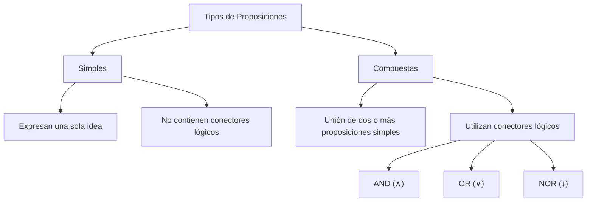

# **UNIDAD 1**
***

## 🎯INDICE
### 📚 Proposiciones y leyes de Inferencia

1. [Definicion de proposiciones](#1-definicion-de-proposiciones)
2. [Tipos de proposiciones](#2-tipos-de-proposiciones)
3. [Conectores lógicos](#3-conectores-logicos)
4. [Tablas de verdad](#4-tablas-de-verdad)
5. [Principales leyes lógicas](#5-principales-leyes-lógicas)
6. [Reglas de inferencia](#6-reglas-de-inferencia)
   
### 🔍 Actividades, prácticas y recursos desarrollados durante la unidad

1. [Actividades practico-experimentales(APES)](#actividades-practico-experimentales-(APES))
2. [Actividades Autonomas (AA)](#actividades-autonomas-(aa))
3. [Actividades de Contacto Docente (ACD)](#actividades-de-docente-(acd))
4. [A](#APE)
### 💭 Reflexión personal

1. [¿Qué fue lo más difícil de entender?](#1-qué-fue-lo-más-difícil-de-entender)
2. [¿Qué tema comprendí mejor?](#2-qué-tema-comprendí-mejor)
3. [¿Cómo puedo aplicar la lógica en mi carrera?](#3-cómo-puedo-aplicar-la-lógica-en-mi-carrera)

***
## 📚 Proposiciones y leyes de Inferencia

### 1. Definicion de proposiciones 

- Una proposición es un enunciado declarativo que puede determinarse como verdadero (V) o falso (F), pero nunca ambas cosas al mismo tiempo. Constituye la base de la lógica proposicional y permite construir razonamientos lógicos mediante el uso de conectores.

### 2. Tipos de proposiciones

### 3. Conectores logicos

- Los conectores lógicos son operadores que permiten relacionar proposiciones para formar expresiones más complejas. Los principales son la negación (¬), conjunción (∧), disyunción (∨), implicación (→) y bicondicional (↔). Cada uno posee reglas específicas que determinan el valor de verdad de la proposición resultante.

### 4. Tablas de verdad

CONJUNCIÓN (∧)

La conjunción es **verdadera únicamente cuando ambas proposiciones son verdaderas**.

| P | Q | P ∧ Q |
|---|---|-------|
| V | V | V |
| V | F | F |
| F | V | F |
| F | F | F |

DISYUNCIÓN (∨)

La disyunción es **verdadera cuando al menos una de las proposiciones es verdadera**. Únicamente es falsa cuando ambas son falsas.

| P | Q | P ∨ Q |
|---|---|-------|
| V | V | V |
| V | F | V |
| F | V | V |
| F | F | F |

DISYUNCIÓN EXCLUSIVA (⊕)

La disyunción exclusiva es **verdadera únicamente cuando una de las proposiciones es verdadera y la otra falsa**.

| P | Q | P ⊕ Q |
|---|---|-------|
| V | V | F |
| V | F | V |
| F | V | V |
| F | F | F |

NEGACIÓN (¬)

La negación invierte el valor de verdad de una proposición.

| P | ¬P |
|---|----|
| V | F |
| F | V |

BICONDICIONAL (↔)

El bicondicional es **verdadero cuando ambas proposiciones tienen el mismo valor de verdad**.

| P | Q | P ↔ Q |
|---|---|-------|
| V | V | V |
| V | F | F |
| F | V | F |
| F | F | V |

CONDICIONAL (→)

La implicación o condicional es **falsa únicamente cuando el antecedente es verdadero y el consecuente es falso**.

| P | Q | P → Q |
|---|---|-------|
| V | V | V |
| V | F | F |
| F | V | V |
| F | F | V |

### 5. Principales leyes lógicas

### 6. Reglas de inferencia

## 🔍 Actividades, prácticas y recursos desarrollados durante la unidad.
---

### Actividades practico-experimentales (APES)

| 📂 Actividad | 📌 Fases   | 🔗 Acceso            |
| ------------ | ---------- | -----------------------|
| **APE 1**    | Fase 1 y 2 | [📄 Abrir documento]() |
| **APE 2**    | Fase 3 y 4 | [📄 Abrir documento]() |
| **APE 3**    | Fase 5 y 6 | [📄 Abrir documento]() |

---

### ACTIVIDADES PRACTICO-EXPERIMENTALES (APES)

| 📂 Actividad | 📌 Fases   | 🔗 Acceso                   |
| ------------ | ---------- | --------------------------- |
| **APE 1**    | Fase 1 y 2 | [📝 Ver actividad]() |
| **APE 2**    | Fase 3 y 4 | [📝 Ver actividad]() |
| **APE 3**    | Fase 5 y 6 |  [📝 Ver actividad) |

---

### Actividades autonomas (AA)

| 📂 Actividad | 👨‍🎓 Modalidad | 🔗 Acceso                    |
| ------------ | --------------- | ---------------------------- |
| **AA**       | Grupal          | [📄 Abrir documento]() |

---

### Actividades de contacto docente (ACD)

| 📂 Actividad | 👨‍🏫 Modalidad | 🔗 Acceso                       |
| ------------ | --------------- | ------------------------------- |
| **ACD**      | Grupal          | [📄 Abrir documento]() |
| **ACD**      | Individual      | [📝 Ver actividad]()      |

---

